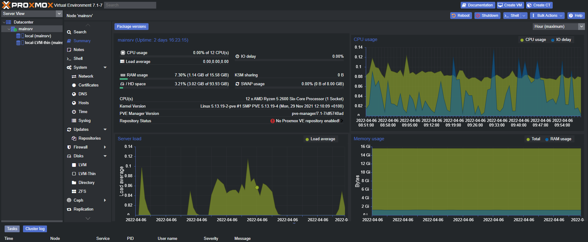

<!--
*** Thanks for checking out the Best-README-Template. If you have a suggestion
*** that would make this better, please fork the repo and create a pull request
*** or simply open an issue with the tag "enhancement".
*** Don't forget to give the project a star!
*** Thanks again! Now go create something AMAZING! :D
-->

<!-- PROJECT SHIELDS -->
<!--
*** I'm using markdown "reference style" links for readability.
*** Reference links are enclosed in brackets [ ] instead of parentheses ( ).
*** See the bottom of this document for the declaration of the reference variables
*** for contributors-url, forks-url, etc. This is an optional, concise syntax you may use.
*** https://www.markdownguide.org/basic-syntax/#reference-style-links
-->

[![LinkedIn][linkedin-shield]][linkedin-url]

<!-- PROJECT LOGO -->
 

  

  <h3 align="center">Proxmox Server Documentation</h3>

  

    Documenting the setup and progress of the Proxmox server for a small network.
     
    <a href="https://github.com/bidduam/Docs-Proxmox/wiki"><strong>Explore the docs »</strong></a>
  

<!-- TABLE OF CONTENTS -->

  
Table of Contents

  <ol>
    <li>
      <a href="#about-the-project">About The Project</a>
      <ul>
        <li><a href="#built-with">Built With</a></li>
      </ul>
    </li>
    <li><a href="#usage">Usage</a></li>
    <li><a href="#roadmap">Roadmap</a></li>
    <li><a href="#contact">Contact</a></li>
    <li><a href="#acknowledgments">Acknowledgments</a></li>
  </ol>

<!-- ABOUT THE PROJECT -->
## About The Project

This repository is for documentation of my home lab. It will have a primary focus on Cybersecurity. The goal at the end of the project is to harden a small LAN according to the CIS 18 framework. The main interface server handling the majority of the network administration is a dedicated server with Proxmox, a debian based virtual environment that is ideal for managing multiple virtual machines and can also contain docker images. Some combination of the two will likely perform most of the network management.

Here's why:

* I believe in learning by doing. I would like to implement security controls on my network that don't impact usability but improve security.
* I want to find or create tools that I would want to use myself, not only to improve security, but also to improve quality of life for network users.
* You should implement DRY principles to the rest of your life :smile:

(<a href="#top">back to top</a>)

### Built With

These are the primary tools utilized in the home lab. Individual Docker containers or VM Images are listed in the Acknowledgments section.

* [Proxmox VE](https://www.proxmox.com/en/proxmox-ve/)
* [Docker](https://www.docker.com/)
* [Debian 11](https://www.debian.org/)

(<a href="#top">back to top</a>)

<!-- USAGE EXAMPLES -->
## Usage

## Main Server Resource Usage

  

_For more examples, please refer to the [Documentation](https://github.com/bidduam/Docs-Proxmox/wiki)_

(<a href="#top">back to top</a>)

<!-- Timeline -->
## Timeline

- [x] Debian Container Hardening Completed - 4-5-22
- [x] Added Kanban List - 4-5-22
- [ ] Created Network Layout Diagram - 4-5-22
- [ ] Add DMZ
- [ ] Add VPN Tunnel

(<a href="#top">back to top</a>)

<!-- CONTACT -->
## Contact

Christian Miller - [LinkedIn](https://www.linkedin.com/in/christian-miller-266684168/) - christianm20358@gmail.com

Project Link: [https://github.com/bidduam/Docs-Proxmox](https://github.com/bidduam/Docs-Proxmox)

(<a href="#top">back to top</a>)

<!-- ACKNOWLEDGMENTS -->
## Acknowledgments

I wanted to acknowledge the invaluable assistance received from these resources. The open source community makes this kind of project possible, as well as various content creator guides.

* [Learn Linux TV - Proxmox Setup](https://www.youtube.com/channel/UCxQKHvKbmSzGMvUrVtJYnUA)
* [GitHub Pages](https://pages.github.com)

(<a href="#top">back to top</a>)

<!-- MARKDOWN LINKS & IMAGES -->
<!-- https://www.markdownguide.org/basic-syntax/#reference-style-links -->
[linkedin-shield]: https://img.shields.io/badge/-LinkedIn-black.svg?style=for-the-badge&logo=linkedin&colorB=555
[linkedin-url]: https://www.linkedin.com/in/christian-miller-266684168/
